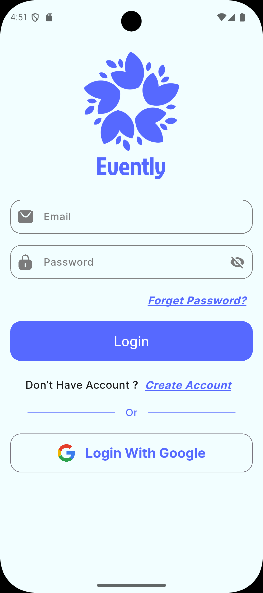
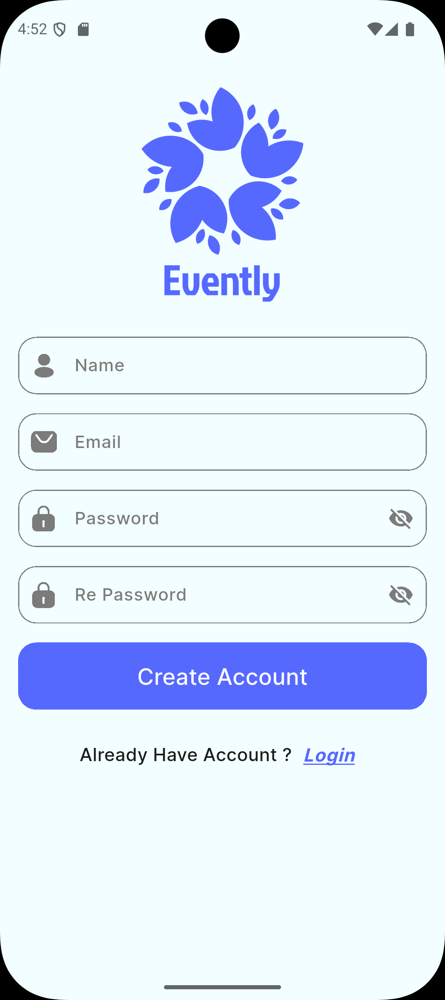
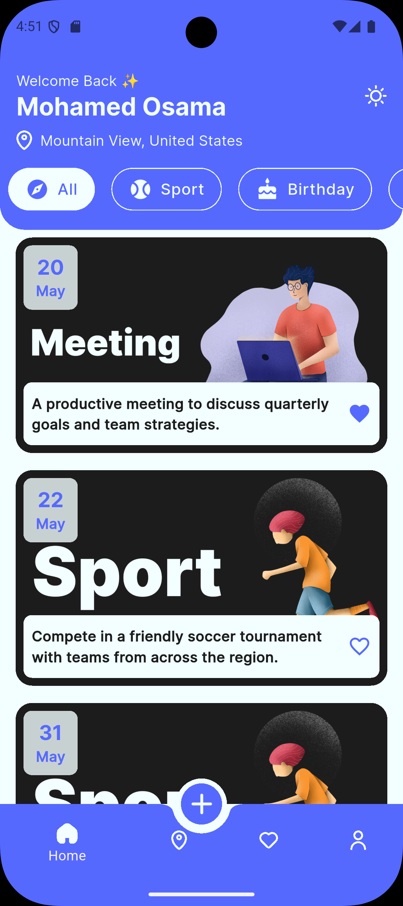
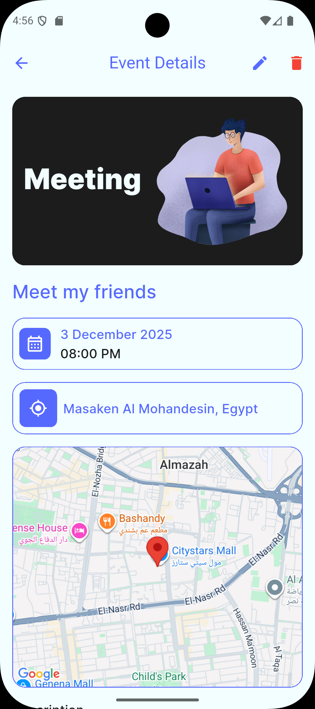
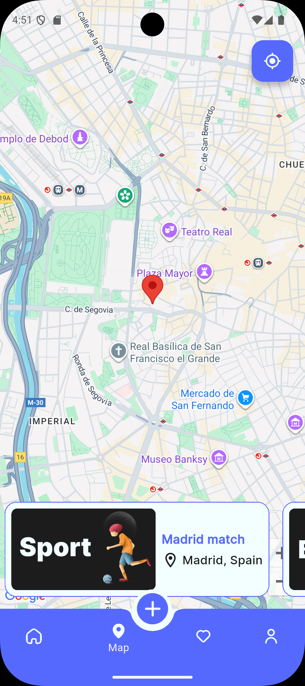
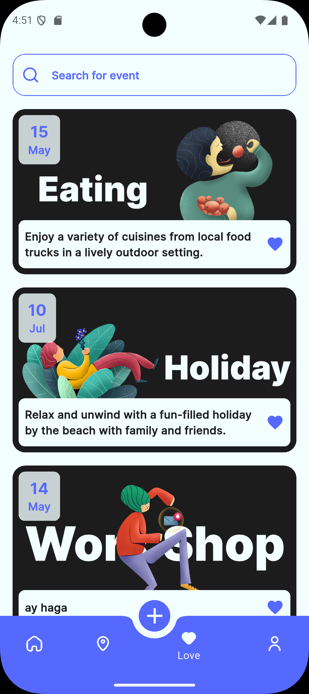
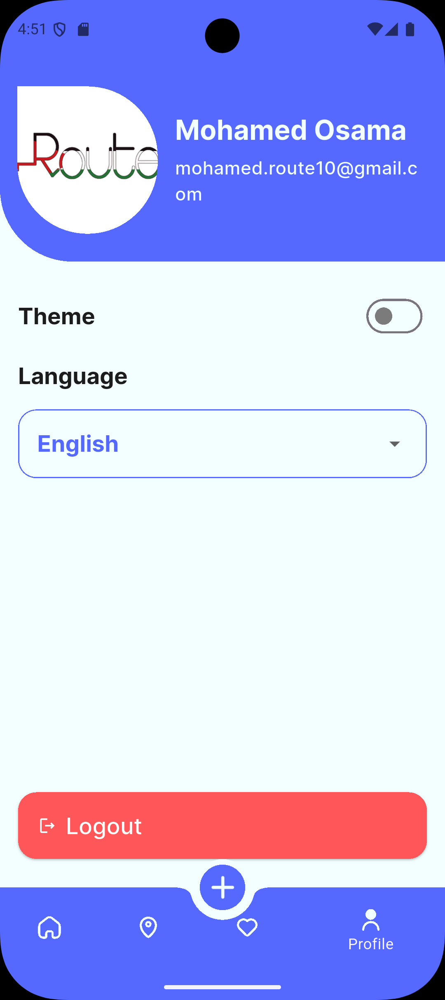

<div align="center">
  <!-- Logo Placeholder -->
  
  <h1>Evently</h1>
  <p><strong>The Ultimate Event Planning Application</strong></p>
</div>

---

## 📖 Overview

**Evently** is a comprehensive event planning application built with Flutter. It allows users to discover, create, and manage events seamlessly. Whether you're organizing a small gathering or a large conference, Evently provides the tools you need to succeed.

Users can browse events created by others, manage their own events, and save their favorite ones. The app integrates **Google Maps** for precise location selection and **Firebase** for a robust backend.

---

## ✨ Features

- **Authentication**: Secure Sign Up, Login, and Forget Password functionality. Support for **Google Sign-In**.
- **Event Discovery**: Browse a wide range of events created by the community.
- **Create Events**: Easily create new events with details like:
  - Event Name & Description
  - Date & Time
  - Location (picked via **Google Maps**)
- **Event Management**:
  - **Edit**: Users can edit the details of events they created.
  - **Delete**: Remove events you no longer need.
- **Favorites**: Save interesting events to your favorites list for quick access.
- **Map Integration**: View event locations directly on an interactive map.
- **Theming**: Beautiful UI with support for Light and Dark modes.
- **Localization**: Support for multiple languages (English & Arabic).

---

## 📸 Screenshots

<div align="center">
  <!-- Screenshots Placeholder -->
  <!-- Add your screenshots here. Example: -->
  
  
  
  
  
  
  
  <!-- <p><em>(Add your app screenshots here)</em></p> -->
</div>

---

## 🛠️ Tech Stack

- **Framework**: [Flutter](https://flutter.dev/)
- **Language**: [Dart](https://dart.dev/)
- **Backend**: [Firebase](https://firebase.google.com/) (Auth, Firestore)
- **State Management**: [Provider](https://pub.dev/packages/provider)
- **Maps**: [Google Maps Flutter](https://pub.dev/packages/google_maps_flutter)
- **Location**: [Location](https://pub.dev/packages/location) & [Geocoding](https://pub.dev/packages/geocoding)
- **UI/UX**: [Flutter ScreenUtil](https://pub.dev/packages/flutter_screenutil), [Google Fonts](https://pub.dev/packages/google_fonts), [Flutter SVG](https://pub.dev/packages/flutter_svg)

---

## 🚀 Getting Started

To run this project locally, you will need to have the following installed:

- [Flutter SDK](https://docs.flutter.dev/get-started/install)
- [Git](https://git-scm.com/)
- A code editor (VS Code or Android Studio)

### Prerequisites

1.  **Firebase Setup**:

    - Create a new project on the [Firebase Console](https://console.firebase.google.com/).
    - Add Android and iOS apps to your Firebase project.
    - Download `google-services.json` (for Android) and `GoogleService-Info.plist` (for iOS) and place them in their respective directories (`android/app` and `ios/Runner`).
    - Enable **Authentication** (Email/Password, Google).
    - Enable **Cloud Firestore**.

2.  **Google Maps API**:
    - Get an API Key from the [Google Cloud Console](https://console.cloud.google.com/).
    - Enable **Maps SDK for Android** and **Maps SDK for iOS**.
    - Add the API key to your `AndroidManifest.xml` and `AppDelegate.swift` / `Info.plist`.

### Installation

1.  **Clone the repository**:

    ```bash
    git clone https://github.com/your-username/evently.git
    cd evently
    ```

2.  **Install dependencies**:

    ```bash
    flutter pub get
    ```

3.  **Run the app**:
    ```bash
    flutter run
    ```

---

## 🤝 Contributing

Contributions are welcome! Please feel free to submit a Pull Request.
